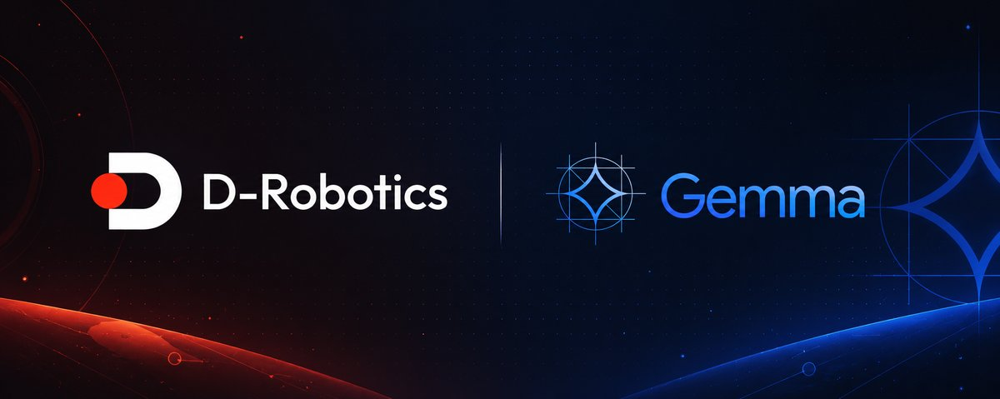
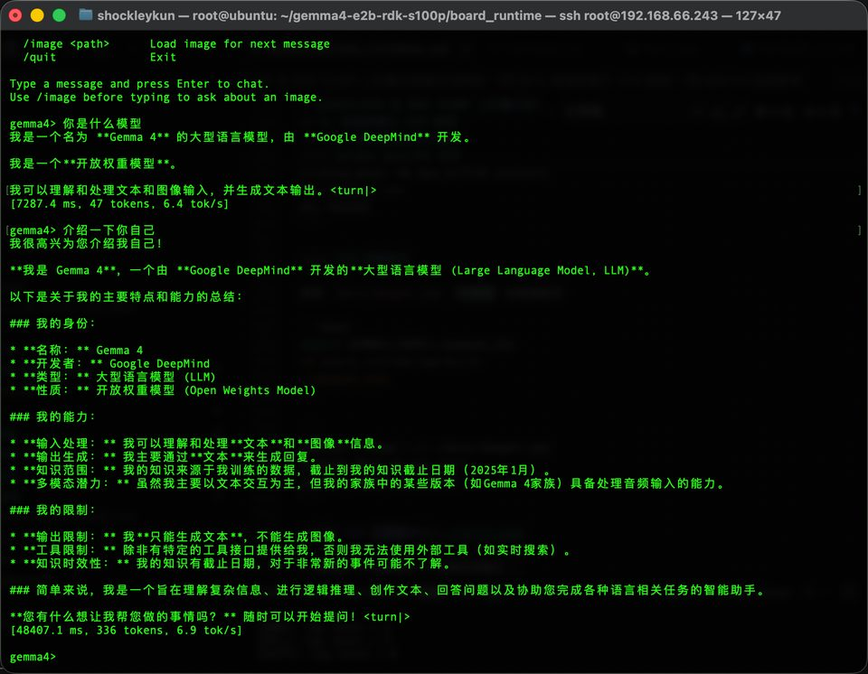
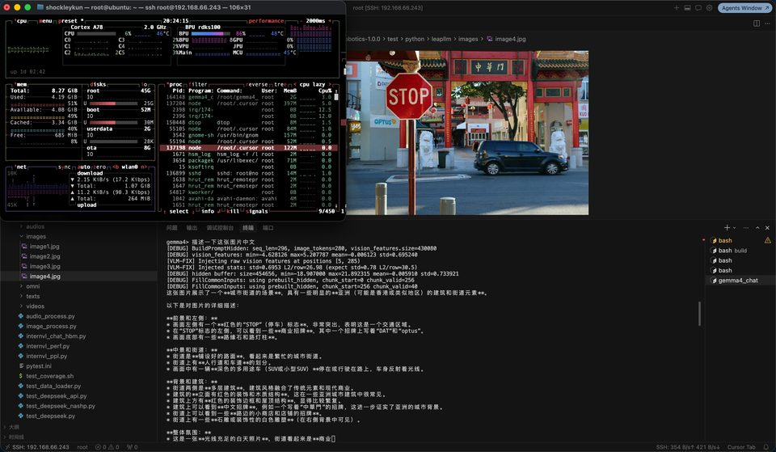

<p align="center">
  
</p>

# Gemma4-E2B on RDK S100P

[中文](./README_zh.md) | **English**

Real-time Vision-Language Model inference for Google **Gemma4-E2B** on the **D-Robotics RDK S100P** board. Runs fully on-device via the BPU.



*Text chat on S100P: ask about the model in Chinese, stream the reply on BPU (~6.9 tok/s).*



*VLM chat on S100P: load an image, ask in Chinese, stream the reply on BPU (86% utilization shown).*

## Quick Start

### 1. Download the pre-compiled models

```bash
pip install huggingface_hub
hf download ShockleyWong/gemma4-e2b-rdk-s100p --local-dir ~/gemma4_e2b
```

### 2. Build the C++ runtime (on the board)

Requires the OE-LLM board image plus `cmake`, `g++`, `libopencv-dev`, and `cargo`.

```bash
cd board_runtime/cpp
mkdir build && cd build
cmake ..
make -j$(nproc)
```

The first build compiles the bundled `tokenizers-cpp` (native HF tokenizers), which takes a few minutes. Subsequent builds are incremental and fast.

### 3. Run

```bash
export GEMMA4_HOME=~/gemma4_e2b
./gemma4_chat
```

Then in the prompt:

```
gemma4> /image photo.jpg          # load an image for the next message
gemma4> Describe this image       # ask about it
gemma4> /reset                    # clear conversation + KV cache
gemma4> /quit                     # exit
```

## What's in this repo


| Path                            | Purpose                                                                                                                                          |
| ------------------------------- | ------------------------------------------------------------------------------------------------------------------------------------------------ |
| `board_runtime/cpp/`            | **Board-side C++ inference runtime** — the `gemma4_chat` entry point plus text/vision engines, KV cache, and a native C++ tokenizer (no Python). |
| `third_party/tokenizers-cpp/`   | Bundled HuggingFace tokenizers C++ binding + sentencepiece.                                                                                      |
| `leap_llm_gemma4/`              | Gemma4 PyTorch model definitions for the OE-LLM quantization toolchain.                                                                          |
| `scripts/`                      | PC-side scripts for HBM compilation, calibration, and verification.                                                                              |
| `docs/QUANTIZATION_TUTORIAL.md` | Full guide: quantization → deployment → VLM.                                                                                                     |


## Recompiling models from source

If you want to re-quantize or modify the HBM models yourself (requires a PC with 128 GB RAM and the OE-LLM SDK), follow the [full quantization tutorial](./docs/QUANTIZATION_TUTORIAL.md). It also covers how to adjust the context length, prefill chunk size, and other compile-time parameters.

## License

[MIT](./LICENSE)