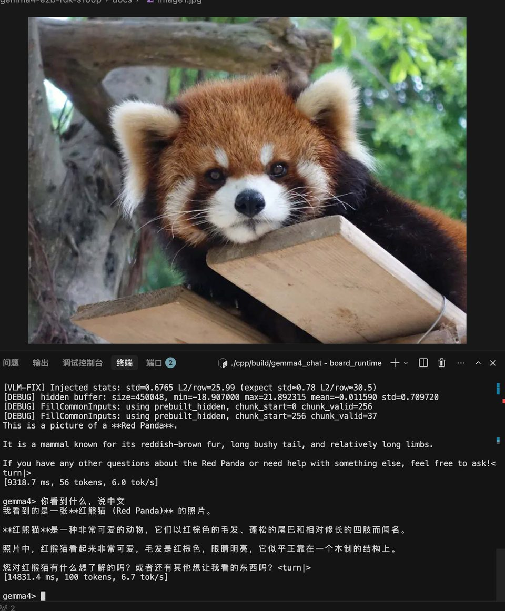

# Gemma4-E2B Quantization & Deployment on RDK S100P

[中文](./QUANTIZATION_TUTORIAL_zh.md) | **English**

> A complete guide from zero to working on-board VLM inference.  
> Based on Google Gemma4-E2B (Vision + Text, no Audio) + D-Robotics OE-LLM 1.0.0 + RDK S100P (`march=nash-m`).  
> Last updated: 2026-06-25

---

## 0. Introduction

This document walks through quantizing and deploying the Gemma4-E2B multimodal model on the RDK S100P — environment setup, model analysis, calibration data, compilation, accuracy verification, packaging, and on-board deployment — including pitfalls we hit and how we fixed them.

**Audience**: developers comfortable with Linux/Python who have some familiarity with the D-Robotics RDK platform.

**After reading you will**:

- Understand Gemma4-E2B's Vision + Text dual-branch architecture and fusion mechanism
- Run PTQ quantization compilation on your own PC
- Know how calibration data affects accuracy
- Verify quantized accuracy (including end-to-end fusion checks)
- Produce an HBM model package ready for S100P deployment

---

## 1. Project Overview

### 1.1 What is Gemma4-E2B

Google Gemma4 is a multimodal model family released on March 31, 2026. E2B is the lightweight variant:

| Spec | Value |
| --- | --- |
| Vision Encoder | 16-layer ViT, hidden=768, ~150M params |
| Audio Encoder | 12-layer Conformer (not covered here) |
| Text LLM | 35-layer Decoder, hidden=1536, ~2B effective params |
| Vocab | 262,144 |
| Vision soft tokens | 280 per image |

E2B Vision and Text are **defined separately** (`Gemma4Config`), unlike the unified 12B architecture (`Gemma4UnifiedConfig`). Adaptation differs accordingly.

### 1.2 RDK S100P Hardware Constraints

Quantization and on-board deployment in this guide target the **RDK S100P** with `--march nash-m`.

| Item | Value | Quantization impact |
| --- | --- | --- |
| RAM | 12 GB LPDDR5 | Model + KV + system should stay under ~10 GB |
| BPU | Nash-M, 80 TOPS | `march=nash-m` |
| BPU cores | **1** | `core_num=1`, `vit_core_num=1` |

### 1.3 OE-LLM Toolchain

OE-LLM is D-Robotics' official LLM quantization/compilation framework:

| Component | Role |
| --- | --- |
| `leap_llm` | PyTorch model defs, calibration forward, compile-mode export |
| `hbdk4_compiler` | MLIR conversion + HBO compilation (BPU instructions) |
| `oellm_build.py` | One-shot entry: calibrate → export → compile → link |
| `hbdk4_runtime` | On-board BPU inference C++ runtime |

### 1.4 End-to-End Data Flow

```
Raw image (any size)
    │
    ▼  Resize 672×960 + [0,1] normalize + 16×16 patchify
[2520, 768] f16  (patch embeddings)
    │
    ▼  Vision HBM (ViT 16 layers + Pooler + Projector)
[280, 1536] f32  (soft tokens, projected to text hidden space)
    │
    ▼  Replace embeddings at image soft-token positions (masked_scatter)
inputs_embeds [seq_len, 1536]  (text embeddings + vision soft tokens)
    │
    ▼  Text HBM (35-layer Decoder + PLE + LM Head)
logits [1, seq_len, 262144]
    │
    ▼  Sample → next token
```

**Two HBMs plus one external embedding table — that's the full deployment model set.**

---

## 2. Model Architecture

You must understand the structure before quantization; otherwise compile flags and on-board inference will misalign.

### 2.1 Gemma4 Family Differences

| Model | Architecture | Vision | Text layers | Text hidden | This tutorial |
| --- | --- | --- | --- | --- | --- |
| **E2B** | `Gemma4Config` | 16-layer ViT | 35 | 1536 | ✅ |
| E4B | `Gemma4Config` | 16-layer ViT | 42 | 2048 | Portable |
| 12B | `Gemma4UnifiedConfig` | Unified | — | — | Different adaptation |

E2B and E4B share `Gemma4Config`; adaptation code is reusable. Main differences are text layer count and `hidden_size`.

### 2.2 Vision Encoder

Full vision path: **PatchEmbed → 16 ViT Encoder layers → Pooler → Projector**

```
Input: pixel_values [num_patches, patch_dim]   i.e. [2520, 768] f16
  │
  ├─ PatchEmbedding
  │   x = 2*(pixel_values - 0.5)        ← [0,1] → [-1,1]
  │   x = ConstFakeQuant(8)(x)
  │   hidden = Linear(768, 768)(x)       ← input_proj
  │   hidden += position_embeddings      ← precomputed 2D positional encoding
  │
  ├─ 16 ViT Encoder layers
  │   Each: RMSNorm → Attention(12 heads) → Residual → RMSNorm → MLP → Residual
  │   Uses 2D RoPE (rope_theta=100)
  │
  ├─ Pooler (3×3 average pooling)
  │   2520 patches → 280 patches (42/3 × 60/3 = 14 × 20)
  │   pooled *= sqrt(768)                ← hidden_size^0.5 scaling
  │
  └─ Projector (RMSNorm + Linear)
      768 → 1536                         ← project into text hidden space

Output: [280, 1536] f32
```

**Key parameters (inferred from E2B `config.json`)**:

```python
# Key vision_config fields
default_output_length = 280    # → determines h_patches, w_patches
patch_size = 16
pooling_kernel_size = 3        # 3×3 pooling

# Derive patch grid:
# num_patches_before_pool = 280 * 3 * 3 = 2520
# Find h, w closest to square with h*w=2520 and h%3==0, w%3==0
# → h_patches=42, w_patches=60
# → input image 42*16=672 × 60*16=960
```

**Note**: `Gemma4VisionConfig` defaults to `h_patches=w_patches=48`, but E2B is actually 42×60. `load_model` infers the correct values from `default_output_length` and `pooling_kernel_size`. **Do not override manually.**

### 2.3 Text LLM

Core text stack: **Embedding + 35 Decoder layers + RMSNorm + LM Head**

```
Input: inputs_embeds [seq_len, 1536] + input_ids [1, seq_len]
  │
  ├─ Main embedding (external tok_embeddings.bin)
  │   embed = weight[token_id] * √1536
  │   √1536 ≈ 39.19
  │
  ├─ Per-Layer Embeddings (PLE) — Gemma4-specific
  │   token_identity = embed_tokens_per_layer(token_id) * √256
  │   context_aware  = RMSNorm(Linear(inputs_embeds)) * (1/√1536)
  │   per_layer_input = (token_identity + context_aware) * (1/√2)
  │   → fed into each Decoder layer
  │
  ├─ 35 Decoder layers
  │   Full attention every 5 layers (layers 4,9,14,19,24,29,34)
  │   Others use sliding attention
  │   KV sharing: last 20 layers reuse KV from matching layer types in first 15
  │
  ├─ RMSNorm
  └─ LM Head (Linear 1536 → 262144)

Output: logits [1, seq_len, 262144]
```

**Key parameters**:

| Parameter | Value | Notes |
| --- | --- | --- |
| `chunk_size` | 256 | Prefill chunk length |
| `cache_len` | 4096 | Max KV cache length |
| `sliding_window` | 512 | Sliding attention window |
| `head_dim` | 256 (sliding) / 512 (full) | Attention head dim |
| `num_attention_heads` | 8 | |
| `num_key_value_heads` | 1 | GQA, 1 KV head |
| `num_kv_shared_layers` | 20 | Last 20 layers share KV |
| `embed_scale` | √1536 ≈ 39.19 | Main embedding scale |
| `per_layer_input_scale` | 1/√2 ≈ 0.707 | PLE merge scale |

**Text HBM inputs** (5 main + 30 KV caches):

| Input | Shape | Type | Notes |
| --- | --- | --- | --- |
| `_input_0` | `[256, 1536]` | f32 | `inputs_embeds` (includes √1536; vision injected here) |
| `_input_1` | `[1, 256]` | i64 | `input_ids` |
| `_input_2` | `[256]` | i32 | `position_ids` |
| `_input_3` | `[256, 4096]` | si16 | `full_mask` |
| `_input_4` | `[256, 4096]` | si16 | `sliding_mask` |
| `_input_5~34` | `[4096, 1, 256/512]` | si8 | 15 K + 15 V caches |

**Why `tok_embeddings.bin` is external**: vocab 262144 × hidden 1536 × 4 bytes ≈ 1.5 GB. Embedding it in the HBM would bloat the model and lookup is inefficient on BPU. OELLM does embedding lookup + √1536 scaling at runtime and feeds `inputs_embeds` into the HBM.

### 2.4 Vision-Text Fusion

This is the easiest place to get on-board inference wrong. Gemma4 VLM fusion has three steps:

**Step 1: Build token sequence**

```
[255999]  [249560]×280  [258882]  [text tokens...]
 <|image>   ── soft     <image|>   "What do you see?"
 BOI       placeholders×280 EOI     actual text
```

`249560` is the 🖼 (U+1F5BC) image soft-token ID — one row of ViT output per position.

**Step 2: Replace embeddings with `masked_scatter`**

In HuggingFace reference code, replace `inputs_embeds` at soft-token positions:

```python
# Pseudocode
inputs_embeds = embed_tokens(input_ids) * embed_scale  # lookup all tokens first
image_mask = (input_ids == 249560)                    # find 280 positions
inputs_embeds[image_mask] = vision_features           # direct replace, no post-processing
```

**Direct replacement — no L2-norm, no √1536, no extra scaling.** Vision HBM output is already projected to text hidden space in the Projector.

**Step 3: PLE at image positions**

The PLE token-identity branch at image positions **does not** use the image token's per-layer embedding. It uses the **pad embedding (token_id=0)** per-layer vectors — matching HuggingFace source behavior.

---

## 3. Environment Setup

### 3.1 System Requirements

| Item | Minimum | Recommended |
| --- | --- | --- |
| OS | Ubuntu 22.04 | Same |
| RAM | 64 GB | 128 GB+ (Text compile peaks ~100 GB) |
| GPU | None (CPU calibration OK) | CUDA GPU (Vision calibration speedup) |
| Disk | 200 GB free | 300 GB+ (Text intermediates ~68 GB) |

### 3.2 Install SDK + conda + Dependencies

```bash
# 1. Download OE-LLM SDK (from D-Robotics official channel)
# Refer to: https://developer.d-robotics.cc/
tar xzf D-Robotics_LLM_S100_1.0.0_SDK.tar.gz

# 2. Create conda environment
conda create -n oellm python=3.10 -y
conda activate oellm

# 3. Install dependencies (order matters!)
cd D-Robotics_LLM_S100_1.0.0_SDK/oellm_build
pip install -r requirements.txt
pip install hbdk4_compiler-*.whl
pip install hbdk4_runtime_aarch64*.whl   # board runtime; optional on PC
pip install leap_llm-*.whl
```

**Why install order matters**: `requirements.txt` includes PyTorch and base deps first; `hbdk4_compiler` and `leap_llm` are version-coupled — install in order to avoid conflicts.

### 3.3 Get Community Adaptation Code

The SDK's bundled `leap_llm` does not include Gemma4 model definitions. Get them from the community repo:

```bash
cd ~/gemma   # your working directory

# Clone community reference repo
git clone https://github.com/xiongqi123123/RDK_OE_LLM_ZOO.git

# Symlink leap_llm into your project (for easy edits)
ln -s $(python -c "import leap_llm; import os; print(os.path.dirname(leap_llm.__file__))") leap_llm
```

`leap_llm/models/gemma4/` and `leap_llm/apis/model/gemma4.py` are the core Gemma4 adapters. `model_factory.py` registers `gemma4-e2b-vision` and `gemma4-e2b-text`.

### 3.4 Download Gemma4-E2B Weights

From HuggingFace (access approval required):

```bash
# Option A: huggingface-cli
huggingface-cli download google/gemma-4-e2b-pt --local-dir ./gemma4-e2b

# Option B: git lfs
git lfs install
git clone https://huggingface.co/google/gemma-4-e2b-pt ./gemma4-e2b
```

Expected files: `config.json`, `model.safetensors`, `tokenizer.json`, `tokenizer_config.json`, `chat_template.jinja`, etc.

---

## 4. Calibration Data

PTQ (Post-Training Quantization) does not train weights; it computes quantization scales from activation distributions on calibration data. **The closer calibration matches real inference, the better the accuracy.**

### 4.1 Why Calibration Data Matters

PTQ workflow:

1. Run calibration data through the float model (forward pass)
2. Collect min/max/distribution of activations per layer
3. Compute INT8 scale and zero-point
4. Quantize weights and activations with those scales

If calibration distribution diverges from inference (e.g. solid color blocks vs real photos), scales are wrong and feature directions get distorted.

### 4.2 Vision Calibration

Vision calibration uses **50 real COCO val2017 images** in `calibration_data/images/`. Download script:

```bash
python download_coco_calib_images.py
```

You can also add your own images (jpg/png/bmp/webp) to `calibration_data/images/`.

### 4.3 Text Calibration

Text calibration needs diverse prompts in OELLM JSON format:

```json
[
  {"text": "What is the capital of France?"},
  {"text": "请用一句话介绍中国的长城。"},
  ...
]
```

Prepare 100–200 entries covering languages, lengths, and topics. We used 150 entries.

### 4.4 Calibration Directory Layout

```
calibration_data/
├── images/              # Vision calibration (50 COCO images)
│   ├── coco_00_000000000802.jpg
│   ├── coco_01_000000280325.jpg
│   └── ...
├── text/                # Text calibration (150 prompts)
│   └── calibration.json
└── text_verify/         # Text accuracy check (2 short prompts)
    └── calibration.json
```

---

## 5. Vision Compilation

### 5.1 Compile Command

```bash
cd ~/gemma
conda activate oellm

# Increase stack size (required by hbdk4 compile_hbo; otherwise segfault)
ulimit -s unlimited

python -u $(python -c "import leap_llm; import os; print(os.path.dirname(leap_llm.__file__))")/apis/oellm_build.py \
    --model_name gemma4-e2b-vision \
    --march nash-m \
    --input_model_path ./gemma4-e2b \
    --output_model_path ./output/gemma4_e2b_vision \
    --calib_image_path ./calibration_data/images \
    --device cuda:0 \
    --vit_core_num 1 \
    2>&1 | tee output/vision_compile.log
```

| Parameter | Value | Notes |
| --- | --- | --- |
| `--model_name` | `gemma4-e2b-vision` | Registered in model_factory.py |
| `--march` | `nash-m` | S100P march |
| `--input_model_path` | HuggingFace weights dir | config.json + model.safetensors |
| `--output_model_path` | Output directory | Compile artifacts |
| `--calib_image_path` | COCO image dir | 50 real images |
| `--device` | `cuda:0` | GPU for calibration forward (CPU works, slower) |
| `--vit_core_num` | `1` | Single core in this guide |

**Do not use `--verifier` here**: post-compile verifier reports `gemma4-e2b-vision does not support LLM` (it applies LLM verification to VLM). The HBM is valid — run `verifier_cli.py` separately.

### 5.2 Compile Pipeline

`oellm_build.py` runs four steps:

```
1. Export     — float model → BC (graph with quant scales)
2. Convert   — BC → MLIR (target ISA)
3. Compile   — MLIR → HBO (BPU binary)      ← slowest, ~100 min
4. Link      — HBO → HBM (final model)
```

Typical log:

```
[Gemma4VisionApi] Loaded 50 calibration images
[Gemma4VisionApi] Running calibration...
Calibrating: 100%|██████████| 50/50 [02:30<00:00]
[Gemma4Vision] Exporting...
Function 'export_module' done in 5.3s
[Gemma4Vision] Converting MLIR...
Function 'convert_mlir' done in 19.3s
[Gemma4Vision] Compiling HBO (core_num=1)...
Function 'compile_hbo' done in 6620.3s     ← ~110 min
[Gemma4Vision] Linking HBM...
Function 'link_models' done in 10.5s
[Gemma4Vision] Done: ./output/gemma4_e2b_vision/gemma4-e2b_vit_ptq.hbm
```

`compile_hbo` is CPU single-threaded for ViT; `HBDK_JOBS` has little effect.

### 5.3 Artifacts

```
output/gemma4_e2b_vision/
├── gemma4-e2b_vit_ptq.bc              # 620 MB  exported BC
├── gemma4-e2b_vit_ptq.convert.bc      # 202 MB  after MLIR convert
├── gemma4-e2b_vit_ptq.hbo             # 363 MB  HBO binary
└── gemma4-e2b_vit_ptq.hbm             # 329 MB  ← deploy this
```

Only `.hbm` is needed on board; intermediates can be deleted later.

### 5.4 FAQ

**Q: `compile_hbo` segfaults**

```bash
ulimit -s unlimited   # run before compile
```

**Q: `--verifier` fails with `gemma4-e2b-vision does not support LLM`**

HBM was generated successfully. Verifier treats VLM as LLM. Use `verifier_cli.py` separately.

**Q: No log output for a long time with `conda run`**

`conda run` buffers stdout. Use `conda activate oellm` + `python -u ... | tee log`:

```bash
conda activate oellm
PYTHONUNBUFFERED=1 python -u ... | tee output/vision_compile.log
```

**Q: Vision HBM I/O shapes?**

```
Input:  _input_0  [2520, 768]   float16   (patchified image)
Output: _output_0 [280, 1536]   float32   (projected soft tokens)
```

Inspect with:

```python
from hbdk4.compiler import load
bc = load("output/gemma4_e2b_vision/gemma4-e2b_vit_ptq.bc")
for inp in bc.functions[0].inputs:
    print(inp.name, list(inp.type.shape), inp.type.np_dtype)
for out in bc.functions[0].outputs:
    print(out.name, list(out.type.shape), out.type.np_dtype)
```

---

## 6. Text Compilation

### 6.1 Compile Command

Text has prefill and decode phases; OELLM compiles both and links one `.hbm`:

```bash
conda activate oellm
ulimit -s unlimited

python -u $(python -c "import leap_llm; import os; print(os.path.dirname(leap_llm.__file__))")/apis/oellm_build.py \
    --model_name gemma4-e2b-text \
    --march nash-m \
    --input_model_path ./gemma4-e2b \
    --output_model_path ./output/gemma4_e2b_text \
    --calib_text_path ./calibration_data/text \
    --chunk_size 256 \
    --cache_len 4096 \
    --device cpu \
    --core_num 1 \
    2>&1 | tee output/text_compile.log
```

| Parameter | Value | Notes |
| --- | --- | --- |
| `--model_name` | `gemma4-e2b-text` | Text branch |
| `--chunk_size` | `256` | Prefill processes 256 tokens per step |
| `cache_len` | `4096` | Max KV cache length |
| `--device` | `cpu` | Text calibration has little GPU benefit |
| `--core_num` | `1` | Single core in this guide |

`tok_embeddings.bin` is exported automatically:

```python
# Runs in Gemma4TextApi.__init__
tok_embs = model.embed_tokens.weight.data * model.embed_tokens.embed_scale
tok_embs.detach().cpu().numpy().tofile("output/gemma4_e2b_text/tok_embeddings.bin")
```

### 6.2 Artifacts

```
output/gemma4_e2b_text/
├── gemma4-e2b_lm_chunk_256_cache_4096_ptq.prefill.bc          # 18.5 GB
├── gemma4-e2b_lm_chunk_256_cache_4096_ptq.prefill_convert.bc  # 4.7 GB
├── gemma4-e2b_lm_chunk_256_cache_4096_ptq.prefill.hbo          # 4.8 GB
├── gemma4-e2b_lm_chunk_256_cache_4096_ptq.decode.bc            # 18.5 GB
├── gemma4-e2b_lm_chunk_256_cache_4096_ptq.decode_convert.bc    # 4.7 GB
├── gemma4-e2b_lm_chunk_256_cache_4096_ptq.decode.hbo           # 4.7 GB
├── gemma4-e2b_lm_chunk_256_cache_4096_ptq.hbm                  # 4.5 GB  ← deploy
└── tok_embeddings.bin                                           # 1.5 GB  ← external embedding
```

**~68 GB total** on disk; on board you only need `.hbm` (4.5 GB) and `tok_embeddings.bin` (1.5 GB).

### 6.3 Memory Management

Text decode compile peaks at **~100 GB RSS**. If RAM is insufficient:

**Option 1: Add swap**

```bash
sudo bash setup_swap.sh   # creates 64 GB swap
```

**Option 2: Limit virtual memory**

```bash
export HBDK_JOBS=29       # dev machine compile parallelism
export HBDK_OPT=0
export HBDK_CACHE_MODE=enable

# Cap process virtual memory at 110 GB (avoid OOM killing the host)
prlimit --as=$((110 * 1024**3)) python -u compile_text_decode_resume.py 2>&1 | tee log
```

**Note**: `HBDK_JOBS=29` is hbdk compile parallelism on the dev machine — **not** on-board BPU core count.

### 6.4 Context Length & Compile Parameters

Key Text HBM parameters are **fixed at compile time** and define on-board context capacity. Defaults:

| Parameter | Where to set | Default | Notes |
| --- | --- | --- | --- |
| KV cache length | env `CACHE_LEN` | 4096 | Shared budget for input + output tokens. Larger → more DDR, longer compile. |
| Prefill chunk size | env `CHUNK_SIZE` | 256 | Tokens per prefill step. Larger → fewer steps, higher peak memory. |

These map to `kCacheLen` / `kChunkSize` in `board_runtime/cpp/gemma4_config.h`. After recompiling HBM, update the runtime config or inference will misalign.

**Example: extend context from 4096 to 8192**

```bash
# 1. Recompile Text HBM on PC (hours)
CHUNK_SIZE=512 CACHE_LEN=8192 bash scripts/compile/run_text_compile.sh
```

```cpp
// 2. Update board runtime (board_runtime/cpp/gemma4_config.h)
constexpr int kChunkSize = 512;   // must match CHUNK_SIZE above
constexpr int kCacheLen  = 8192;  // must match CACHE_LEN above
```

```bash
# 3. Rebuild runtime
cd board_runtime/cpp && mkdir build && cd build
cmake .. && make -j$(nproc)
```

**Runtime-only parameters** (no HBM recompile):

| Parameter | Where | Default | Notes |
| --- | --- | --- | --- |
| Sliding window | `kSlidingWindow` | 512 | Decode sliding-attention window; must be ≤ `kCacheLen`. |
| Max output tokens | `--max-tokens N` | `kCacheLen` | Per-turn generation limit at runtime. |

> **Memory cost**: doubling `CACHE_LEN` doubles KV cache DDR usage. Confirm free board memory before increasing.  
> HBM filename `gemma4-e2b_lm_chunk_256_cache_4096_ptq.hbm` keeps the old naming pattern; contents reflect whatever `CHUNK_SIZE` / `CACHE_LEN` you used.

---

## 7. Accuracy Verification

On PC, compare quantized model (BC) vs float model using **cosine similarity** (1 = identical; closer to 1 is better).

### 7.1 Quantization Accuracy (This Model)

| Model | Accuracy |
| --- | --- |
| Vision HBM (`gemma4-e2b_vit_ptq.hbm`) | **0.9888** |
| Text HBM (`gemma4-e2b_lm_chunk_256_cache_4096_ptq.hbm`) | **0.9540** |

Separate checks for Vision and Text vs float outputs.

### 7.2 How to Verify

**Vision BC**

```bash
cd ~/gemma && conda activate oellm

python -u leap_llm/apis/verifier_cli.py \
    --model_name gemma4-e2b-vision \
    --model_dir ./gemma4-e2b \
    --quant_vlm_model_path ./output/gemma4_e2b_vision/gemma4-e2b_vit_ptq.bc \
    --input_image_path ./calibration_data/images/coco_00_000000000802.jpg
```

**Text BC** (text only, no vision)

```bash
python -u quick_text_verify.py
# Output: output/e2b_text_verify_quick.json
```

If dev machine and board share a network, you can also run HBM verification on BPU:

```bash
bash run_remote_hbm_verify.sh   # pass --remote_ip for board IP
```

---

## 8. Packaging Deployment Files

### 8.1 Deployment Layout

```bash
mkdir -p gemma4_e2b_deploy/{model,tokenizer}

# Model files (3 large files)
cp output/gemma4_e2b_vision/gemma4-e2b_vit_ptq.hbm \
   gemma4_e2b_deploy/model/

cp output/gemma4_e2b_text/gemma4-e2b_lm_chunk_256_cache_4096_ptq.hbm \
   gemma4_e2b_deploy/model/

cp output/gemma4_e2b_text/tok_embeddings.bin \
   gemma4_e2b_deploy/model/

# Tokenizer files
cp gemma4-e2b/tokenizer.json \
   gemma4-e2b/tokenizer_config.json \
   gemma4-e2b/chat_template.jinja \
   gemma4-e2b/config.json \
   gemma4_e2b_deploy/tokenizer/
```

Final tree:

```
gemma4_e2b_deploy/
├── model/
│   ├── gemma4-e2b_vit_ptq.hbm                              # 329 MB  Vision
│   ├── gemma4-e2b_lm_chunk_256_cache_4096_ptq.hbm          # 4.5 GB  Text
│   └── tok_embeddings.bin                                  # 1.5 GB  Token embedding
└── tokenizer/
    ├── tokenizer.json                                      # 31 MB
    ├── tokenizer_config.json
    ├── chat_template.jinja
    └── config.json
```

### 8.2 Pack vs Skip

| File | Size | Pack? | Reason |
| --- | --- | --- | --- |
| Vision `.hbm` | 329 MB | ✅ | Required |
| Text `.hbm` | 4.5 GB | ✅ | Required |
| `tok_embeddings.bin` | 1.5 GB | ✅ | Required |
| Tokenizer | ~32 MB | ✅ | Required |
| Vision/Text `.bc` | ~37 GB | ❌ | Compile intermediates |
| Vision/Text `.hbo` | ~5 GB | ❌ | Compile intermediates |
| `compile_cache/` | ~26 GB | ❌ | Compile cache |

Packed size ~**4.3 GB** (gzip); unpacked ~**6.3 GB**.

---

## 9. On-Board Deployment & VLM Inference

How to deploy compiled HBM models on S100P and run Gemma4-E2B VLM inference.

### 9.1 Two Paths: Run Prebuilt vs Compile Yourself

| | Path A: Run prebuilt (recommended) | Path B: Compile from source |
| --- | --- | --- |
| **For** | Users who want quick VLM demos | Developers changing runtime or porting |
| **Needs** | Download prebuilt HBM + build C++ runtime (~1 min) | Full OE-LLM SDK + this repo |
| **Steps** | See §9.2 below | See [board_runtime/README.md](../board_runtime/README.md) |

> Most users only need **Path A**: download models → build runtime on board (gcc only, no OE-LLM compiler) → run.

### 9.2 Path A: Quick Deploy (~5 Minutes on Board)

#### Step 1: Download Prebuilt Models

On S100P:

```bash
pip install huggingface_hub
hf download ShockleyWong/gemma4-e2b-rdk-s100p --local-dir ~/gemma4_e2b
```

Verify integrity (optional):

```bash
sha256sum ~/gemma4_e2b/model/*.hbm

# Expected:
# 470791849d21cffadb388cc61c8f4b1452078c1722d302fd8a8ac775ee9769f1  ...vit_ptq.hbm
# 3e4d4940051e4e8dc0cb434e972e7aae75d49504da3fac435e303f68af73a25f  ...lm_..._ptq.hbm
```

#### Step 2: Build C++ Runtime

Requires `cmake`, `g++`, `libopencv-dev`, and `cargo` (first build only — compiles vendored `tokenizers-cpp`).

```bash
cd gemma4-e2b-rdk-s100p/board_runtime/cpp
mkdir build && cd build
cmake ..
make -j$(nproc)
# Outputs: gemma4_chat, gemma4_server, gemma4_demo, gemma4_text_bench, gemma4_golden_verify
```

> **Note**: Board build only needs gcc, cmake, OpenCV, and Horizon BPU runtime headers (`/usr/hobot/`). **No** PC-side `hbdk4_compiler` or `leap_llm`.

#### Step 3: Run VLM Inference

```bash
export GEMMA4_HOME=~/gemma4_e2b
./gemma4_chat
```

Example session:

```
gemma4> /image /path/to/red_panda.jpg
Processing image... Image loaded (430080 features).
gemma4> Describe this image
This is a photograph of a Red Panda resting on a wooden structure.
It has reddish-brown fur, white accents on its face and chest...
```

### 9.3 VLM Fusion (On-Board Implementation)

Board runtime must follow these rules at Vision→Text fusion or output will be garbage:

#### ① Inject vision features as-is

```cpp
// Correct: std::copy directly, no post-processing
for (int t = 0; t < 280; ++t) {
    std::copy(vision_output + t * 1536,
              vision_output + (t+1) * 1536,
              inputs_embeds + image_pos[t] * 1536);
}
```

#### ② PLE uses pad embedding at image positions

Gemma4 Text Per-Layer Embedding (PLE) has two paths:

- **token-identity**: `embed_tokens_per_layer(token_id)`
- **context-aware**: depends on `inputs_embeds`

At image soft-token positions (`token_id=249560`), **token-identity uses pad (`token_id=0`)**, not 249560's per-layer embedding.

```cpp
// Text HBM input[1] (input_ids): image positions should be 0 (pad), not 249560
for (auto& id : input_ids) {
    if (id == 249560) id = 0;  // pad_token_id
}
```

#### ③ Chat template format

Prompts must follow `chat_template.jinja`, not raw string concatenation:

```
<bos><|turn>user
<|image>[249560×280]<image|>What do you see?<turn|>
<|turn>model
```

The C++ `TokenizerBridge` (native `tokenizers-cpp`) handles this formatting — **no Python required**.

### 9.4 Verify On-Board Inference

#### Golden mask/KV alignment

```bash
# Place golden_mask_kv/ under $GEMMA4_HOME/golden_mask_kv/
# (from pc_delivery/golden_mask_kv.tar.gz)

export GEMMA4_HOME=~/gemma4_e2b
./gemma4_golden_verify --prompt prompt_0
```

Expected:

```
input_ids: OK
position_ids: OK
inputs_embeds: OK max_diff=0 cosine=1
full_mask: OK max_diff=0 cosine=1
sliding_mask: OK max_diff=0 cosine=1
=== Summary ===
ALL PASSED
```

#### VLM image test

Use `docs/image1.jpg` (red panda) on board:

```bash
export GEMMA4_HOME=~/gemma4_e2b
cd board_runtime/cpp/build
./gemma4_chat
```

```
gemma4> /image ../../docs/image1.jpg
gemma4> What do you see?
gemma4> 你看到什么，说中文
```



| Test image | Expected | Actual |
| --- | --- | --- |
| Red panda (`image1.jpg`) | Red Panda / 红熊猫 + appearance description | ✅ Correct (see above) |

### 9.5 Performance Reference

Typical S100P single-core BPU (`core_num=1`):

| Phase | Latency | Notes |
| --- | --- | --- |
| Vision inference | ~300 ms | Single image, ViT 16 layers |
| Text prefill | ~500 ms | 294-token VLM prompt |
| Text decode | ~200 ms/tok | Per generated token |
| End-to-end VLM | ~50 s | 294 prompt + 250 output tokens |

### 9.6 FAQ

**Q: Board build fails with `Horizon BPU SDK not found`**

```bash
ls /usr/hobot/lib/libdnn.so
ls /usr/include/hobot/dnn/hb_dnn.h
```

If missing, install OE-LLM board runtime (`hbdk4_runtime_aarch64*.whl` or board image).

**Q: VLM output is garbage / semantically wrong**

Check in order:

1. Vision HBM SHA256 = `47079184...` (COCO recalibrated build)
2. After injection, vision feature std ≈ 0.65–0.79 (not 1.0)
3. `input_ids` at image positions = `0` (pad), not `249560`
4. Prompt uses chat template (`<|turn>user` / `<|turn>model`)
5. Run `gemma4_golden_verify` for mask/KV alignment

**Q: Output truncated at 256 tokens**

KV capacity `kCacheLen=4096` is fixed at HBM compile time. prompt + output ≤ 4096. VLM prompt ≈ 294 tokens → max output ~3800 tokens. Model stops at `<turn|>` automatically.

---

## Appendix: Model File Download

Pre-compiled HBM models on HuggingFace:

```bash
pip install huggingface_hub
hf download ShockleyWong/gemma4-e2b-rdk-s100p --local-dir ./gemma4_e2b_deploy
```

| File | Description |
| --- | --- |
| `gemma4-e2b_vit_ptq.hbm` | Vision HBM (329 MB) |
| `gemma4-e2b_lm_chunk_256_cache_4096_ptq.hbm` | Text HBM (4.5 GB) |
| `tok_embeddings.bin` | Token embedding table (1.5 GB) |
| `tokenizer/` | Tokenizer files |

Verify integrity:

```bash
sha256sum gemma4_e2b_deploy/model/*.hbm
```
